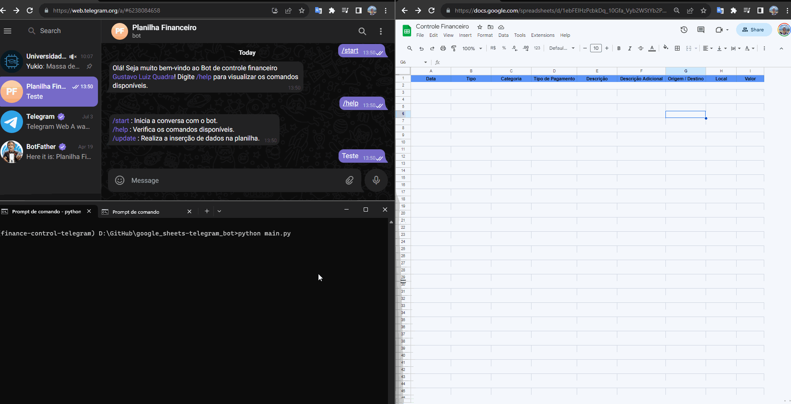

# **Google Sheets - Bot Telegram**

- [**Google Sheets - Bot Telegram**](#google-sheets---bot-telegram)
  - [**1. Introdução**](#1-introdução)
  - [**2. Objetivo**](#2-objetivo)
  - [**3. Sobre os Arquivos**](#3-sobre-os-arquivos)
  - [**4. Instruções para Execução Local**](#4-instruções-para-execução-local)
    - [**4.1 Instalação do Python**](#41-instalação-do-python)
    - [**4.2 Preparação do Ambiente Python**](#42-preparação-do-ambiente-python)
    - [**4.3 Criação de um Bot no Telegram**](#43-criação-de-um-bot-no-telegram)
    - [**4.4 Criação do arquivo credentials.json para API do Google Sheets**](#44-criação-do-arquivo-credentialsjson-para-api-do-google-sheets)
  - [**5. Ideias de Melhorias**](#5-ideias-de-melhorias)
  - [**6. Links e Referências**](#6-links-e-referências)

---



---

## **1. Introdução**
Esse repositório se refere à um projeto pessoal com o objetivo de aprendizagem na utilização da API do [Google Sheets](https://www.google.com/sheets/about/) e na construção de Bots utilizando o [Telegram](https://web.telegram.org).

Nesse projeto, também aprendi a utilização da biblioteca [logging](https://docs.python.org/3/library/logging.html) e como realizar a escrita de commits com padrões convencionais.

## **2. Objetivo**
O objetivo do projeto é realizar a construção de um Bot no Telegram que, ao receber mensagens, irá inserir os dados em uma planilha de Controle Financeiro.

É importante ressaltar que a automação foi criada para se adequar ao formato da minha planilha e as mensagens encaminhadas devem ter as colunas separadas por vírgula e espaço (", ").

Exemplo de mensagens aceitas :
```
27/07/2023, Despesa Adicional, Esportes, Cartão Débito, Vôlei, Vôlei com amigos, Arena de Vôlei, Banco Y, -10.50
28/07/2023, Receita, Salário, Pix, Trabalho, Descrição Adicional, Empresa X, Banco X, 2000
```

## **3. Sobre os Arquivos**
- [.gitignore](.gitignore) = Arquivos ignorados pelo Git.
- [main.py](main.py) = Script Python com a automação.
- [requirements.txt](requirements.txt) = Pacotes utilizados para criar o ambiente virtual Python.

## **4. Instruções para Execução Local**

### **4.1 Instalação do Python**
Para a instalação do Python, é interessante realizar a instalação da distribuição [Anaconda](https://www.anaconda.com/download/), que é uma plataforma de distribuição para Python e oferece diversos pacotes necessários para a Ciência de Dados.

**OBS : Ao realizar a instalação não esqueça de adicionar o Anaconda como variável de ambiente.**
### **4.2 Preparação do Ambiente Python**
Com o anaconda instalado, podemos criar um novo ambiente virtual com os pacotes utilizados no projeto através do seguinte comando no CMD :

```
conda create --name finance-control-telegram --file requirements.txt
```

Esse comando irá realizar a criação do ambiente virtual e a instalação dos pacotes utilizados no projeto, que estão no arquivo [requirements.txt](requirements.txt).

Com isso, você pode realizar a ativação do ambiente virtual com o comando abaixo :

```
conda activate finance-control-telegram
```

### **4.3 Criação de um Bot no Telegram**
Para realizar a criação de um Bot no Telegram, você deve iniciar uma conversa com o BotFather e encaminhar o comando /newbot para iniciar a construção de um novo Bot.

Com isso, você será capaz de escolher o nome e o usuário para o seu Bot e receberá o Token API.

Após receber o Token API, realize a criação de um arquivo chamado .env e insira o seguinte conteúdo :
```
TOKEN_BOT_API=<TOKEN>
```

### **4.4 Criação do arquivo credentials.json para API do Google Sheets**
Para a utilização da API do Google Sheets, optei por [realizar a criação de uma conta de serviço](https://cloud.google.com/iam/docs/keys-create-delete?hl=pt-br#iam-service-account-keys-create-console), onde após a criação, será possível realizar o download do arquivo credentials.json que será utilizado para a comunicação da API.

Após isso, será necessário realizar a criação de um projeto no Google Cloud e a autorização para a utilização da API do Google Sheets. Segue um link que pode lhe auxiliar na criação do projeto : [Integração Google Sheets com Python - Hashtag Treinamentos](https://www.hashtagtreinamentos.com/integracao-do-google-sheets-com-python)

## **5. Ideias de Melhorias**
- Integração com API do ChatGPT para encaminhar mensagens com linguagem natural, por exemplo, "Gastei x reais em tal lugar no dia 29/07/2023" e ele realizar a transformação para o formato específico.
- Criação de novos comandos e tratamentos de erros para a comunicação do Bot.
- Criação de novas mensagens de logs e criação de uma pasta específica para o armazenamento.

## **6. Links e Referências**
- [Conventional Commits Pattern - Victor Ribeiro](https://medium.com/linkapi-solutions/conventional-commits-pattern-3778d1a1e657)
- [Integração Google Sheets com Python - Hashtag Treinamentos](https://www.hashtagtreinamentos.com/integracao-do-google-sheets-com-python)